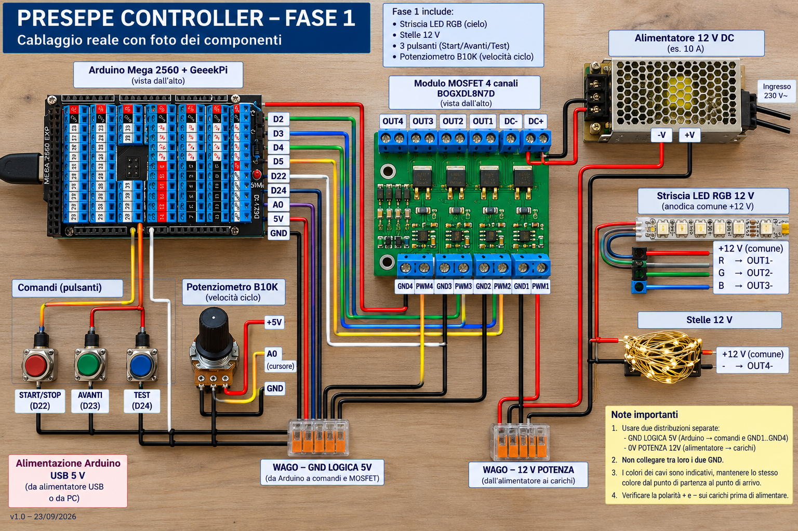
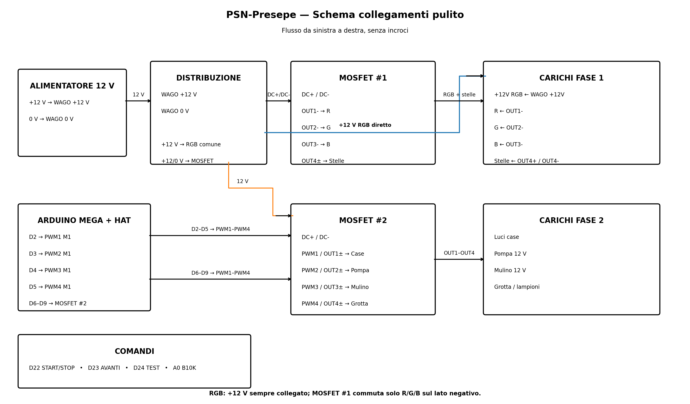

# PSN-Presepe

## Demo online Wokwi

▶️ [Apri la simulazione interattiva PSN-Presepe su Wokwi](https://wokwi.com/projects/476035349322038273)

La demo permette di provare direttamente dal browser il ciclo giorno/notte, le strisce RGB, il cielo stellato, OLED e comandi senza hardware reale.


Controller basato su Arduino Mega 2560 per la gestione modulare di un presepe a 12 V.

**Italiano** | [English](README_EN.md)

## Mockup della centralina



> Mockup concettuale della disposizione della centralina. Per i collegamenti elettrici fare riferimento agli schemi vettoriali presenti nella cartella `docs/`.

## Schema elettrico



> Questo è lo **schema di riferimento aggiornato** per il cablaggio. La striscia RGB 12 V è a positivo comune: il +12 V è diretto, mentre R, G e B vengono commutati sul lato negativo dai MOSFET.

## Mappatura hardware attuale

I pin di Arduino **non alimentano direttamente i carichi a 12 V**. Ogni uscita del Mega pilota l'ingresso `PWM` del relativo canale MOSFET. I normali carichi a due fili possono utilizzare la coppia `OUT+` / `OUT-`; la striscia RGB a positivo comune viene invece collegata come indicato qui sotto.

### MOSFET #1 — Cielo RGB

| Arduino Mega | Ingresso MOSFET | Uscita MOSFET | Carico 12 V | Controllo |
|---:|---|---|---|---|
| D2 | PWM1 | OUT1- | Striscia RGB — ritorno R | PWM / dimmerabile |
| D3 | PWM2 | OUT2- | Striscia RGB — ritorno G | PWM / dimmerabile |
| D4 | PWM3 | OUT3- | Striscia RGB — ritorno B | PWM / dimmerabile |
| — | PWM4 | OUT4+ / OUT4- | **Libero** | — |

La striscia RGB è un carico **12 V a positivo comune (anodo comune)**. Il suo unico filo `+12 V` viene collegato direttamente alla distribuzione +12 V protetta/WAGO e rimane sempre alimentato. I tre canali MOSFET commutano invece i ritorni R/G/B sul lato negativo:

```text
+12 V alimentatore ──► F1 CIELO ──┬──► +12 V comune RGB
                                   └──► DC+ MOSFET #1

RGB R ─────────────────────────────────────────► OUT1-
RGB G ─────────────────────────────────────────► OUT2-
RGB B ─────────────────────────────────────────► OUT3-

Mega D2 ───────────────────────────────────────► PWM1  (Rosso)
Mega D3 ───────────────────────────────────────► PWM2  (Verde)
Mega D4 ───────────────────────────────────────► PWM3  (Blu)

0 V alimentatore ──────────────────────────────► DC- MOSFET
```

La striscia RGB **non deve essere cablata come tre carichi indipendenti a due fili**. In questa configurazione `OUT1+`, `OUT2+` e `OUT3+` non sono necessari per la striscia RGB.

### Stelle WS2811 indirizzabili

Le stelle sono ora una stringa **WS2811 12 V da 50 pixel individualmente indirizzabili**. Non passano dal MOSFET: D5 è il segnale DATA.

```text
+12 V alimentatore ──► fusibile/distribuzione ──► WS2811 +12 V
0 V alimentatore ───────────────────────────────► WS2811 GND
Arduino GND ───────────────────────────────────► stesso 0 V comune
Mega D5 ── resistenza 330–470 Ω ──────────────► WS2811 DATA / DIN
```

Con le WS2811 il **GND Arduino deve essere comune allo 0 V dell'alimentatore 12 V**, perché il segnale DATA necessita dello stesso riferimento elettrico. Il Mega continua comunque a essere alimentato a 5 V via USB: il +12 V non deve mai essere collegato ai pin 5 V o I/O di Arduino.

Il firmware può comandare ogni stella separatamente, con luminosità e colore differenti. Dei 50 pixel disponibili, a ogni ciclo vengono selezionate casualmente 20 stelle attive, che compaiono progressivamente durante il crepuscolo e si spengono durante l'alba. Il canale 4 del MOSFET #1 rimane libero.

### MOSFET #3 e #4 — RGB laterali alba/tramonto

Per rendere alba e tramonto più dinamici vengono aggiunte **due strisce RGB analogiche 12 V da 1 m**, indipendenti dalla striscia principale:

| Posizione | Effetto | Mega R/G/B | Modulo |
|---|---|---|---|
| Sinistra | Tramonto | D10 / D11 / D12 | MOSFET #3, CH1–CH3 |
| Destra | Alba | D44 / D45 / D46 | MOSFET #4, CH1–CH3 |

Ogni striscia ha un ramo +12 V protetto dedicato: **F2 ALBA** alimenta sia il +12 V comune della striscia ALBA sia il DC+ del MOSFET #4; **F3 TRAMONTO** alimenta sia il +12 V comune della striscia TRAMONTO sia il DC+ del MOSFET #3. I ritorni R/G/B vanno ai tre OUT- del relativo modulo MOSFET. Il quarto canale di ciascun modulo resta libero. **D13 rimane PWM libero.**

Nel firmware la striscia sinistra cresce e cala gradualmente durante il TRAMONTO, con tonalità calde rosso/arancio. La striscia destra esegue un andamento analogo durante l'ALBA, con una tonalità più chiara. La striscia RGB principale continua contemporaneamente la transizione generale del cielo: la sovrapposizione crea uno spostamento laterale della luce.

### Relè ON/OFF — 4 moduli, 16 uscite

Luci case, pompe, mulino e gli altri carichi che richiedono soltanto ON/OFF vengono gestiti dai **quattro moduli relè 12 V a 4 canali**. I MOSFET restano dedicati ai carichi che richiedono PWM/dimmer.

| Gruppo | Mega | Modulo / ingresso |
|---|---:|---|
| Grp_01_01–Grp_01_04 | D25–D28 | RELÈ #1 IN1–IN4 |
| Grp_02_01–Grp_02_04 | D29–D32 | RELÈ #2 IN1–IN4 |
| Grp_03_01–Grp_03_04 | D33–D36 | RELÈ #3 IN1–IN4 |
| Grp_04_01–Grp_04_04 | D37–D40 | RELÈ #4 IN1–IN4 |

Per ogni scheda: **+12 V di alimentazione del ramo relè → DC+**, **0 V comune → DC-**. Il ramo di alimentazione delle schede relè verrà protetto e dimensionato separatamente quando sarà definita la distribuzione definitiva dei carichi. I morsetti COM/NO/NC restano disponibili per i futuri carichi. Per un carico normalmente spento si useranno normalmente COM + NO; la protezione del carico comandato è distinta da quella che alimenta l'elettronica della scheda relè.

I jumper S1–S4 permettono di scegliere HIGH/LOW trigger. Il firmware gestisce già le 16 uscite nella modalità TEST; nel simulatore viene usata la logica HIGH=ON. Prima del collegamento definitivo dei moduli reali va verificata la posizione dei jumper e, se necessario, impostato `RELE_ACTIVE_LOW` nel firmware.

#### Schedulazione scenografica dei relè

Le accensioni e gli spegnimenti durante il ciclo sono definiti nel firmware dalla tabella `SCHEDULAZIONE_RELE[]`. Ogni evento contiene:

`{ NOME_FASE, NOME_RELE, ACCESO_SPENTO, PERCENTUALE_FASE }`

La percentuale è **relativa alla singola fase**, non all'intero ciclo. Per esempio:

```cpp
const EventoRele SCHEDULAZIONE_RELE[] = {
  { TRAMONTO, Grp_01_03, true,  30 },
  { NOTTE,    Grp_01_03, false, 50 }
};
```

Con questa configurazione `Grp_01_03` si accende al **30% della fase TRAMONTO**, resta acceso durante il resto del tramonto, il crepuscolo e la prima metà della notte, quindi si spegne al **50% della fase NOTTE**.

Lo stato dei relè viene ricostruito dalla posizione corrente del ciclo, quindi rimane coerente anche usando **AVANTI**, pausa/ripresa o modificando la durata con il potenziometro. All'inizio di un nuovo ciclo, prima che siano raggiunti nuovi eventi, i relè partono spenti. In futuro la scenografia ON/OFF può essere modificata semplicemente aggiungendo o cambiando le righe della tabella.

### Display OLED ELEGOO EL-SM-008

Display di stato OLED **0,96 pollici, 128×64, I²C**, alimentazione 3,3–5 V, indirizzo I²C a 7 bit **0x3C**.

| OLED | Arduino Mega 2560 |
|---|---|
| GND | GND |
| VCC | 5 V |
| SDA | D20 / SDA |
| SCL | D21 / SCL |

Il display è **opzionale**: il firmware deve continuare a funzionare normalmente anche se l'OLED non è collegato. All'avvio il software verifica la presenza del display all'indirizzo 0x3C; se non risponde, prosegue senza OLED.

Il firmware usa il display come interfaccia di stato:
- schermata normale: **fase corrente**, percentuale di avanzamento della singola fase, barra grafica, RUN/PAUSA e durata totale del ciclo;
- START/STOP: mette in pausa o riprende il ciclo; in **PAUSA** l'OLED mostra stabilmente fase, percentuale della fase e i valori RGB correnti delle tre strisce; alla ripresa mostra brevemente **RIPRESA**;
- AVANTI: popup **AVANTI** con la nuova fase;
- TEST: feedback **TEST**;
- variazione significativa del B10K: popup **VELOCITA** con la durata effettiva del ciclo in minuti.

I popup durano circa 1,8 secondi e poi il display torna automaticamente alla schermata della fase. L'aggiornamento normale dell'OLED è non bloccante; l'assenza del display non impedisce l'avvio del controllore.

> Nota: sul Mega 2560 l'I²C hardware usa **D20=SDA** e **D21=SCL**. Eventuali esempi che indicano D21/D22 si riferiscono ad altre piattaforme, ad esempio ESP32.


Quando il ciclo viene messo in **PAUSA**, l'OLED mostra stabilmente la fase e la percentuale raggiunta, insieme ai valori RGB correnti delle tre strisce:

- `C R,G,B` = cielo RGB principale;
- `T R,G,B` = RGB laterale TRAMONTO;
- `A R,G,B` = RGB laterale ALBA.

I valori sono quelli logici 0–255 inviati al PWM e permettono di fermare la scena su una tonalità interessante, trascriverla e riutilizzarla successivamente per la taratura dei colori.

### Comandi

| Arduino Mega | Dispositivo | Collegamento |
|---:|---|---|
| D22 | Pulsante START/STOP | D22 ↔ pulsante ↔ GND logica |
| D23 | Pulsante AVANTI | D23 ↔ pulsante ↔ GND logica |
| D24 | Pulsante TEST | D24 ↔ pulsante ↔ GND logica |
| A0 | Potenziometro B10K velocità ciclo | 5 V ↔ esterno, A0 ↔ cursore, GND ↔ esterno |

> **Prova senza potenziometro:** se il potenziometro B10K su A0 viene scollegato, non lasciare A0 flottante: la lettura analogica potrebbe assumere valori casuali e far variare la durata del ciclo. Per una prova stabile, collegare temporaneamente **A0 direttamente a GND**. Il firmware leggerà A0=0, corrispondente alla durata minima del ciclo di **1 minuto**.

I pulsanti utilizzano `INPUT_PULLUP`, quindi non richiedono una resistenza di pull-up esterna. Il GND logico di Arduino viene distribuito tramite WAGO agli ingressi `GND1...GND4` dei MOSFET e ai comandi.

## Sequenza di inizializzazione all'accensione

Prima di iniziare il normale ciclo scenografico, il firmware esegue un **autotest visivo di circa 8 secondi**. I relè restano spenti e le uscite vengono provate in sequenza:

1. **ALBA** — striscia RGB alba in bianco brillante per 2 secondi;
2. **CIELO** — striscia RGB principale in bianco brillante per 2 secondi;
3. **TRAMONTO** — striscia RGB tramonto in bianco brillante per 2 secondi;
4. **STELLE** — tutti i 50 pixel WS2811 in bianco brillante per 2 secondi.

Durante l'intera sequenza l'OLED mostra **Inizializzazione**, il nome dell'uscita in prova, la percentuale complessiva e una progress bar. Al termine tutte le uscite vengono spente, compare **PRONTO** per 900 ms e il timer del ciclo viene avviato da zero: il presepe entra quindi normalmente nella fase **GIORNO**.

Questa sequenza è visibile anche nella simulazione Wokwi e costituisce un rapido controllo all'accensione di strisce, stelle e relativi collegamenti.

## Funzionamento scenografico

Il ciclo automatico coordina la **striscia RGB principale**, le **due strisce RGB laterali da 1 m** dedicate ad alba e tramonto e le **50 stelle WS2811 individualmente indirizzabili**.

1. **Giorno:** stelle spente; la striscia RGB crea l'illuminazione diurna.
2. **Tramonto:** stelle spente; la striscia principale passa progressivamente ai colori caldi mentre la striscia laterale sinistra entra e poi cala gradualmente, creando movimento e direzionalità nella luce.
3. **Crepuscolo:** le stelle iniziano a comparire **una alla volta in ordine casuale**, mentre il cielo RGB diventa progressivamente più scuro.
4. Ogni stella ha una **luminosità massima diversa**, per evitare un cielo uniforme e artificiale.
5. Circa il **18% delle stelle** presenta un leggerissimo **scintillio morbido**, senza lampeggi netti.
6. **Notte:** il cielo stellato è completo ma non uniforme; le stelle mantengono intensità differenti.
7. **Alba:** le stelle scompaiono progressivamente mentre la striscia principale torna verso il giorno e la striscia laterale destra entra e poi cala gradualmente, simulando una sorgente luminosa direzionale.
8. A ogni nuova notte viene generata una **disposizione differente** delle stelle e delle relative intensità.
9. Il colore delle stelle è impostato su **bianco caldo**, evitando un effetto RGB multicolore.

## Manuale di montaggio filo per filo

Questa sezione è il riferimento pratico per il cablaggio. **Non lavorare mai sul circuito con l'alimentatore 230 V collegato.** **Il +12 V non deve mai essere collegato direttamente a un pin del Mega, a 5 V, A0, SDA/SCL o DATA:** il Mega lavora a logica 5 V e i pin I/O non sono ingressi a 12 V. Il Mega è alimentato separatamente via USB 5 V. Il +12 V alimenta soltanto carichi e moduli di potenza. Lo **0 V 12 V e GND Arduino devono essere in comune** per i segnali PWM e per DATA WS2811.

### 1. Distribuzione alimentazione 12 V

> **Cosa significa “+12 V protetto” in questo manuale?**  
> Significa semplicemente che il filo **positivo +12 V è passato attraverso un fusibile prima di raggiungere il carico**. Il fusibile va quindi inserito **sul polo positivo (+12 V)** del ramo da proteggere, non sullo 0 V/negativo.
>
> Esempio: `alimentatore +12 V → fusibile → striscia LED +12 V`.
>
> Se un cavo o un utilizzatore va in cortocircuito, il fusibile di quel ramo interrompe il positivo e protegge soprattutto **cablaggio e connettori** dalla forte corrente che l'alimentatore potrebbe fornire. Quando nelle tabelle seguenti compare la dicitura **“+12 V protetto”**, bisogna quindi leggere: **“+12 V proveniente da un'uscita del portafusibili”**.

Portare il **+12 V** dell'alimentatore all'ingresso positivo del portafusibili/distributore. Ogni uscita del portafusibili avrà il proprio fusibile e alimenterà un singolo ramo: RGB principale, stelle WS2811, RGB tramonto, RGB alba e gli altri carichi. Lo **0 V (negativo)** non passa attraverso questi fusibili di ramo: viene portato alla barra negativa del distributore, se presente, oppure a una morsettiera/WAGO 0 V comune.

```text
ALIMENTATORE 12 V

 +12 V ──► ingresso + portafusibili
                │
                ├─► F1 CIELO ─────► +12 V RGB principale + DC+ MOSFET #1
                ├─► F2 ALBA ──────► +12 V RGB alba + DC+ MOSFET #4
                ├─► F3 TRAMONTO ──► +12 V RGB tramonto + DC+ MOSFET #3
                ├─► F4 STELLE ────► +12 V WS2811
                └─► ... futuri rami protetti (relè/carichi)

  0 V ────────────────────────────► barra negativa / WAGO 0 V comune
                                      ├─► GND/0 V carichi
                                      └─► GND Arduino (riferimento comune)
```

**Scelta progettuale:** CIELO, ALBA, TRAMONTO e STELLE hanno ciascuno un fusibile dedicato. Per le tre strisce RGB, l'uscita del relativo fusibile viene sdoppiata: alimenta sia il +12 V comune della striscia sia il `DC+` della scheda MOSFET che la pilota. Il `DC-` della scheda MOSFET torna allo 0 V comune. Non è previsto un ulteriore fusibile generico separato per le quattro schede MOSFET: la protezione segue il ramo/carico alimentato. Il MOSFET #2, al momento non assegnato a una delle tre RGB, verrà protetto insieme al futuro ramo che utilizzerà.

**Regola pratica per il montaggio:** ogni volta che nel manuale leggi `+12 V protetto`, **non collegare quel filo direttamente al +12 V dell'alimentatore**: collegalo a una delle uscite positive del portafusibili, dopo il relativo fusibile.

| Da | A | Nota |
|---|---|---|
| PSU +12 V | ingresso portafusibili +12 V | cavo dimensionato per la corrente totale |
| PSU 0 V | WAGO/morsettiera 0 V comune | ritorno comune |
| WAGO 0 V | Mega GND | riferimento logico comune |
| WAGO 0 V | DC- MOSFET #1 | ritorno comune modulo CIELO |
| WAGO 0 V | DC- MOSFET #2 | modulo disponibile per futuri carichi |
| WAGO 0 V | DC- MOSFET #3 | ritorno comune modulo TRAMONTO |
| WAGO 0 V | DC- MOSFET #4 | ritorno comune modulo ALBA |
| F1 — CIELO | RGB principale +12 V e DC+ MOSFET #1 | ramo protetto dedicato |
| F2 — ALBA | RGB alba +12 V e DC+ MOSFET #4 | ramo protetto dedicato |
| F3 — TRAMONTO | RGB tramonto +12 V e DC+ MOSFET #3 | ramo protetto dedicato |
| F4 — STELLE | WS2811 +12 V | ramo protetto dedicato |

### 2. MOSFET #1 — RGB principale

| Filo | Da | A |
|---|---|---|
| 1 | Mega D2 | MOSFET #1 PWM1 |
| 2 | Mega GND | MOSFET #1 GND1 |
| 3 | Mega D3 | MOSFET #1 PWM2 |
| 4 | Mega GND | MOSFET #1 GND2 |
| 5 | Mega D4 | MOSFET #1 PWM3 |
| 6 | Mega GND | MOSFET #1 GND3 |
| 7 | F1 — CIELO (+12 V protetto) | RGB principale +12 V |
| 8 | F1 — CIELO (+12 V protetto) | MOSFET #1 DC+ |
| 9 | RGB principale R | MOSFET #1 OUT1- |
| 10 | RGB principale G | MOSFET #1 OUT2- |
| 11 | RGB principale B | MOSFET #1 OUT3- |

Il **DC- del MOSFET #1 deve essere collegato allo 0 V comune**, come indicato nella sezione 1. PWM4/GND4 e OUT4 restano liberi. Prima del cablaggio definitivo verificare sul modulo reale la continuità tra DC+ e OUT+; non assumere la topologia del modulo senza questa verifica.

### 3. Stelle WS2811

| Filo | Da | A |
|---|---|---|
| 12 | F4 — STELLE (+12 V protetto) | WS2811 +12 V |
| 13 | WAGO 0 V comune | WS2811 GND |
| 14 | Mega D5 | resistenza 330–470 Ω |
| 15 | uscita resistenza | WS2811 DATA/DIN |

Rispettare la freccia/direzione DATA della stringa. La resistenza va preferibilmente vicino all'ingresso della prima WS2811.

### 4. MOSFET #3 — RGB sinistra / TRAMONTO

| Filo | Da | A |
|---|---|---|
| 16 | Mega D10 | MOSFET #3 PWM1 |
| 17 | Mega GND | MOSFET #3 GND1 |
| 18 | Mega D11 | MOSFET #3 PWM2 |
| 19 | Mega GND | MOSFET #3 GND2 |
| 20 | Mega D12 | MOSFET #3 PWM3 |
| 21 | Mega GND | MOSFET #3 GND3 |
| 22 | F3 — TRAMONTO (+12 V protetto) | RGB sinistra +12 V |
| 23 | F3 — TRAMONTO (+12 V protetto) | MOSFET #3 DC+ |
| 24 | RGB sinistra R | MOSFET #3 OUT1- |
| 25 | RGB sinistra G | MOSFET #3 OUT2- |
| 26 | RGB sinistra B | MOSFET #3 OUT3- |

Il **DC- del MOSFET #3 deve essere collegato allo 0 V comune**, come indicato nella sezione 1. PWM4/GND4 e OUT4 restano liberi.

### 5. MOSFET #4 — RGB destra / ALBA

| Filo | Da | A |
|---|---|---|
| 27 | Mega D44 | MOSFET #4 PWM1 |
| 28 | Mega GND | MOSFET #4 GND1 |
| 29 | Mega D45 | MOSFET #4 PWM2 |
| 30 | Mega GND | MOSFET #4 GND2 |
| 31 | Mega D46 | MOSFET #4 PWM3 |
| 32 | Mega GND | MOSFET #4 GND3 |
| 33 | F2 — ALBA (+12 V protetto) | RGB destra +12 V |
| 34 | F2 — ALBA (+12 V protetto) | MOSFET #4 DC+ |
| 35 | RGB destra R | MOSFET #4 OUT1- |
| 36 | RGB destra G | MOSFET #4 OUT2- |
| 37 | RGB destra B | MOSFET #4 OUT3- |

Il **DC- del MOSFET #4 deve essere collegato allo 0 V comune**, come indicato nella sezione 1. PWM4/GND4 e OUT4 restano liberi. D13 rimane disponibile come uscita PWM di riserva.

### 6. Quattro moduli relè — 16 uscite ON/OFF

I quattro moduli vengono montati e collegati al Mega. Tutti i carichi che richiedono soltanto ON/OFF — casette, pompa, mulino, grotta, lampioni e altri effetti — devono essere assegnati a queste 16 uscite. D6–D9 non sono più riservati a questi carichi.

La nomenclatura standard è `Grp_GG_RR`: `GG` identifica il gruppo/scheda relè (01–04) e `RR` il relè del gruppo (01–04).

| Uscita | Mega | Modulo / ingresso |
|---|---:|---|
| Grp_01_01 | D25 | RELÈ #1 IN1 |
| Grp_01_02 | D26 | RELÈ #1 IN2 |
| Grp_01_03 | D27 | RELÈ #1 IN3 |
| Grp_01_04 | D28 | RELÈ #1 IN4 |
| Grp_02_01 | D29 | RELÈ #2 IN1 |
| Grp_02_02 | D30 | RELÈ #2 IN2 |
| Grp_02_03 | D31 | RELÈ #2 IN3 |
| Grp_02_04 | D32 | RELÈ #2 IN4 |
| Grp_03_01 | D33 | RELÈ #3 IN1 |
| Grp_03_02 | D34 | RELÈ #3 IN2 |
| Grp_03_03 | D35 | RELÈ #3 IN3 |
| Grp_03_04 | D36 | RELÈ #3 IN4 |
| Grp_04_01 | D37 | RELÈ #4 IN1 |
| Grp_04_02 | D38 | RELÈ #4 IN2 |
| Grp_04_03 | D39 | RELÈ #4 IN3 |
| Grp_04_04 | D40 | RELÈ #4 IN4 |

Per **ciascuno dei quattro moduli** collegare anche:

| Da | A |
|---|---|
| +12 V del ramo di alimentazione relè | DC+ |
| 0 V comune | DC- |
| pin Mega indicato sopra | IN1 / IN2 / IN3 / IN4 |

Per ora i morsetti **COM/NO/NC possono rimanere senza carico**. Così tutta la parte di comando `Grp_01_01`–`Grp_04_04` è montata e pronta. In modalità TEST le 16 uscite vengono provate una alla volta, una pressione di TEST per ciascun relè. La sequenza completa comprende 30 test: CIELO R/G/B, TRAMONTO R/G/B, ALBA R/G/B, STELLE R/G/B su tutti i 50 pixel, tutte le 50 stelle in bianco caldo, tutto insieme e infine i 16 relè individuali.

Quando assegneremo un carico 12 V normalmente spento, lo schema tipico sarà: **+12 V protetto del carico → COM → NO → positivo carico**, mentre il negativo del carico torna allo **0 V comune**. Il fusibile del carico sarà dimensionato in funzione del carico e del relativo cablaggio.

### 7. Display OLED EL-SM-008

Collegare i quattro fili:

| Filo | Da | A |
|---|---|---|
| OLED 1 | GND | Mega GND |
| OLED 2 | VCC | Mega 5 V |
| OLED 3 | SCL | Mega D21 / SCL |
| OLED 4 | SDA | Mega D20 / SDA |

Indirizzo I²C firmware: **0x3C**. Il display è opzionale: se viene scollegato o dimenticato, il controllore del presepe deve continuare a funzionare.

### 8. Pulsanti

I pulsanti sono momentanei NO. Grazie a INPUT_PULLUP non servono resistenze esterne.

| Filo | Da | A |
|---|---|---|
| 38 | Mega D22 | START/STOP NO |
| 39 | START/STOP COM | Mega GND |
| 40 | Mega D23 | AVANTI NO |
| 41 | AVANTI COM | Mega GND |
| 42 | Mega D24 | TEST NO |
| 43 | TEST COM | Mega GND |

Gli eventuali contatti NC dei pulsanti rimangono scollegati.

### 9. Buzzer piezo passivo opzionale

Il buzzer è un accessorio opzionale. Collegare il positivo/filo rosso a **Mega D6** e il negativo/filo nero a **Mega GND**. Deve essere un buzzer/piezo **passivo**, così il firmware può generare note diverse con `tone()`. Se il buzzer non è collegato, il presepe funziona normalmente senza errori.

Durante il boot il buzzer riproduce a tempo sostenuto **Astro del ciel** fino alla frase **“mite agnello Redentor”**. La melodia parte insieme all'autotest ALBA → CIELO → TRAMONTO → STELLE; se dura oltre gli 8 secondi del test visivo, le uscite vengono spente e il boot attende la conclusione della melodia prima di mostrare PRONTO. Al termine il buzzer viene disattivato con `noTone()`.

### 10. Potenziometro B10K

| Filo | Da | A |
|---|---|---|
| 44 | Mega +5 V | estremo B10K |
| 45 | Mega A0 | cursore/centrale B10K |
| 46 | Mega GND | altro estremo B10K |

Se il senso di rotazione risulta invertito rispetto a quello desiderato, scambiare semplicemente i due fili degli estremi; il cursore A0 resta invariato.

### 11. Controllo prima dell'accensione

1. Mega scollegato dalla USB e alimentatore 12 V scollegato dalla rete.
2. Verificare che **+12 V non arrivi mai a 5 V, A0 o a un pin digitale del Mega**.
3. Verificare con multimetro polarità +12 V / 0 V.
4. Verificare la massa comune Mega GND ↔ PSU 0 V.
5. Verificare a circuito spento che **F1 alimenti soltanto CIELO +12 V e DC+ MOSFET #1**, **F2 soltanto ALBA +12 V e DC+ MOSFET #4**, **F3 soltanto TRAMONTO +12 V e DC+ MOSFET #3**, **F4 soltanto WS2811 +12 V**.
6. Verificare che i **DC- dei MOSFET #1, #3 e #4** vadano allo 0 V comune.
7. Verificare che R/G/B delle tre strisce vadano esclusivamente agli **OUT-** corretti e che nessun R/G/B sia collegato direttamente a +12 V o a un pin del Mega.
8. Verificare DATA WS2811: **Mega D5 → resistenza 330–470 Ω → DIN** della prima stella, rispettando la direzione DATA.
9. Prima di inserire i fusibili F1–F4, verificare con il multimetro che non ci sia continuità anomala/cortocircuito tra +12 V protetto e 0 V sui relativi rami.
10. Alla prima accensione inserire **un solo ramo/fusibile alla volta**, iniziando senza carichi di movimento; usare TEST per verificare la corrispondenza tra canale e carico.
11. Solo dopo aver verificato un ramo, passare al successivo.

### Riepilogo pin Mega

| Pin | Funzione |
|---:|---|
| D2 | RGB principale R |
| D3 | RGB principale G |
| D4 | RGB principale B |
| D5 | DATA WS2811 |
| D6 | buzzer piezo passivo opzionale |
| D7–D9 | liberi / riserva |
| D10 | RGB tramonto R |
| D11 | RGB tramonto G |
| D12 | RGB tramonto B |
| D13 | PWM libero |
| D20 | SDA OLED EL-SM-008 (I²C, opzionale) |
| D21 | SCL OLED EL-SM-008 (I²C, opzionale) |
| D22 | START/STOP |
| D23 | AVANTI |
| D24 | TEST |
| D25–D40 | Grp_01_01–Grp_04_04, quattro moduli relè |
| D44 | RGB alba R |
| D45 | RGB alba G |
| D46 | RGB alba B |
| A0 | potenziometro B10K |

## Firmware

Aprire:

`firmware/PSN-Presepe/PSN-Presepe.ino`

con Arduino IDE e selezionare **Arduino Mega or Mega 2560**.

Il firmware attuale implementa cielo RGB principale, due RGB laterali alba/tramonto, stelle WS2811, comandi, OLED, buzzer piezo passivo opzionale e modalità TEST. D7–D9 restano liberi/di riserva. I carichi ON/OFF vengono gestiti tramite i 16 relè D25–D40.

## GitHub Actions

Il workflow `.github/workflows/build.yml` può essere avviato manualmente dalla pagina GitHub Actions e parte automaticamente quando viene pubblicata una nuova GitHub Release associata a un tag. Compila il firmware per:

`arduino:avr:mega`

I file compilati vengono pubblicati come artifact della GitHub Action. Per le build avviate da una Release vengono inoltre allegati alla Release il firmware `PSN-Presepe.ino.hex` e il pacchetto `PSN-Presepe-Windows-Portable.zip`.

## Simulazione Wokwi

La simulazione Wokwi riproduce Mega 2560, OLED, pulsanti, potenziometro, buzzer, 50 stelle indirizzabili, 16 uscite relè e le tre strisce RGB. Il file principale è `simulation/diagram.json`.

È disponibile anche `simulation/diagram-no-display.json`, variante dedicata ai test **senza OLED**: è mantenuta allineata a `diagram.json` per tutte le modifiche di cablaggio e componenti che non riguardano il display. Serve a verificare che il firmware continui ad avviarsi e funzionare normalmente quando l'OLED opzionale non è presente.

Per le strisce CIELO, TRAMONTO e ALBA vengono usati i componenti custom `rgb-strip.chip.json` + `rgb-strip.chip.c`: leggono i tre PWM R/G/B e visualizzano una barra del colore risultante. A differenza del normale LED RGB di Wokwi, una striscia a `(0,0,0)` viene mostrata **completamente nera**, quindi nero significa inequivocabilmente **SPENTO**. Il componente gestisce anche PWM 0 e 255 come livelli statici.

I componenti custom sono esclusivamente visuali: non cambiano il firmware e non simulano la potenza elettrica, i MOSFET o i 12 V reali. La documentazione completa della simulazione e dei file da copiare manualmente nel progetto Wokwi è in `simulation/README.md`.

La CI Wokwi rimane per ora opzionale: la normale compilazione GitHub Actions non richiede token o servizi esterni.

## 🧪 Provare PSN-Presepe online con Wokwi — guida passo passo

La simulazione permette di provare il firmware **direttamente dal browser**, senza installare Arduino IDE e senza collegare il Mega reale.

> **Importante:** Wokwi serve soprattutto a verificare firmware, pulsanti, potenziometro, OLED e sequenze. Non simula fedelmente la parte elettrica a 12 V, la potenza dei MOSFET o i carichi reali. I 16 relè sono rappresentati da indicatori.

### 1. Apri un nuovo Arduino Mega

Apri questo indirizzo nel browser:

**https://wokwi.com/projects/new/arduino-mega**

Deve comparire un progetto nuovo con un **Arduino Mega 2560**.

### 2. Copia il firmware

Nel repository PSN-Presepe apri:

`firmware/PSN-Presepe/PSN-Presepe.ino`

Premi il pulsante GitHub per copiare tutto il contenuto del file.

Torna su Wokwi, apri il file **sketch.ino**, cancella tutto quello che contiene e incolla il firmware PSN-Presepe.

> Su Wokwi il file si chiama `sketch.ino`; nel repository si chiama `PSN-Presepe.ino`. È normale.

### 3. Installa le tre librerie

Nel pannello del codice di Wokwi apri **Library Manager** e aggiungi:

```text
Adafruit NeoPixel
Adafruit SSD1306
Adafruit GFX Library
```

Wokwi creerà automaticamente il proprio `libraries.txt`.

Nel repository è presente anche `simulation/libraries.txt` come riferimento aggiornato delle librerie necessarie.

### 4. Carica il nostro schema elettrico virtuale

Nel repository scegli uno dei due diagrammi:

- `simulation/diagram.json` per la simulazione completa con OLED;
- `simulation/diagram-no-display.json` per verificare il funzionamento senza display.

Copia **tutto** il contenuto del diagramma scelto.

In Wokwi apri il file **diagram.json**, seleziona tutto, cancella il contenuto esistente e incolla quello del repository.

Dopo pochi istanti il diagramma deve mostrare il Mega e i componenti del PSN-Presepe.

### 5. Avvia

Premi il pulsante verde **▶ Start Simulation**.

Wokwi compilerà il firmware. La prima compilazione può richiedere qualche secondo.

Se usi `simulation/diagram.json`, il Mega virtuale parte e sul display OLED appare l'interfaccia PSN-Presepe. Se usi `simulation/diagram-no-display.json`, il test è corretto quando il firmware continua ad avviarsi e a gestire normalmente autotest, ciclo, RGB, stelle, pulsanti e relè senza OLED.

### 6. Prova il potenziometro

Clicca sul potenziometro **Durata ciclo** e cambiane il valore.

L'OLED deve mostrare temporaneamente **VELOCITA** e la durata del ciclo. Dopo circa 1,8 secondi ritorna alla schermata della fase corrente.

Per fare prove veloci conviene portare il ciclo verso il minimo, circa **1 minuto**.

### 7. Prova i pulsanti

Usa i tre pulsanti virtuali:

| Pulsante | Cosa deve succedere |
|---|---|
| START/STOP | mette in pausa/riprende il ciclo; in PAUSA l'OLED resta sulla schermata con fase, % fase e valori RGB C/T/A; alla ripresa mostra brevemente RIPRESA |
| AVANTI | salta immediatamente alla fase successiva |
| TEST | avvia la sequenza di prova delle uscite |

Con **AVANTI** puoi quindi controllare rapidamente:

`GIORNO → TRAMONTO → CREPUSCOLO → NOTTE → ALBA → GIORNO`

senza aspettare l'intero ciclo.

### 8. Cosa guardare sull'OLED

Questa verifica riguarda la simulazione completa con `simulation/diagram.json`. Durante il funzionamento normale l'OLED deve mostrare:

- nome della fase;
- percentuale **0–100% della fase corrente**;
- barra di avanzamento;
- RUN durante il ciclo; quando è in PAUSA la schermata viene sostituita dai valori RGB delle tre strisce;
- durata impostata del ciclo.

La percentuale riparte da 0 quando cambia fase.

### 9. Apri il Serial Monitor

Durante la simulazione apri **Serial Monitor**.

Il firmware comunica a **115200 baud** e stampa informazioni diagnostiche: fase, percentuale del ciclo, durata, valore A0 e stato RUN/PAUSA.

Se l'OLED virtuale non viene rilevato, il firmware deve comunque continuare a funzionare: è intenzionalmente opzionale.

### 10. Cosa rappresentano i componenti virtuali

Le tre barre custom **CIELO**, **TRAMONTO** e **ALBA** rappresentano visivamente le tre strisce RGB analogiche 12 V reali. Leggono i tre segnali PWM R/G/B e mostrano il colore risultante; **nero significa striscia spenta**. Sono una rappresentazione logica e visiva: Wokwi non simula elettricamente l'alimentazione 12 V, i MOSFET, le correnti o la potenza delle strisce.

La striscia NeoPixel virtuale rappresenta le **50 stelle**. Wokwi usa un componente addressable compatibile per visualizzare l'effetto; nel presepe reale utilizziamo la stringa WS2811 a 12 V con il cablaggio documentato.

Gli indicatori `Grp_01_01`–`Grp_04_04` rappresentano le 16 uscite dei quattro moduli relè collegate a D25–D40. In modalità TEST vengono accese una alla volta dopo i 14 test di cielo/RGB/stelle; dopo `Grp_04_04` la sequenza riparte dal primo test e START esce dalla modalità TEST.

### 11. Se Wokwi dà errore

Controlla nell'ordine:

1. di aver scelto **Arduino Mega 2560**;
2. che `sketch.ino` contenga l'ultima versione del firmware;
3. che siano installate tutte e tre le librerie;
4. che `diagram.json` sia stato copiato integralmente dal file scelto: `simulation/diagram.json` oppure `simulation/diagram-no-display.json`;
5. leggi il messaggio rosso della compilazione o il Serial Monitor.

Se modifichiamo firmware o cablaggio del progetto, anche i file nella cartella `simulation/` devono essere aggiornati insieme.


> **Stelle:** i 50 pixel WS2811 restano fisicamente disponibili, ma a ogni ciclo ne vengono scelte casualmente solo **20**, mantenute a luminosità volutamente bassa. Tutte le 20 stelle attive hanno un proprio ciclo asincrono e variano dolcemente la luminosità. A ogni nuova notte la disposizione viene rigenerata.

## Nota elettrica

Con l'introduzione delle stelle WS2811, **Arduino GND e lo 0 V dell'alimentatore 12 V sono collegati in comune** per fornire il riferimento al segnale DATA. Il Mega resta alimentato separatamente a 5 V via USB. Prima del cablaggio definitivo verificare con il multimetro la continuità tra `DC+` e gli eventuali `OUT+` utilizzati. Per pompa e mulino devono inoltre essere verificati corrente nominale, corrente di spunto e protezione dei carichi induttivi.

---

By **Vanni Brutto**
